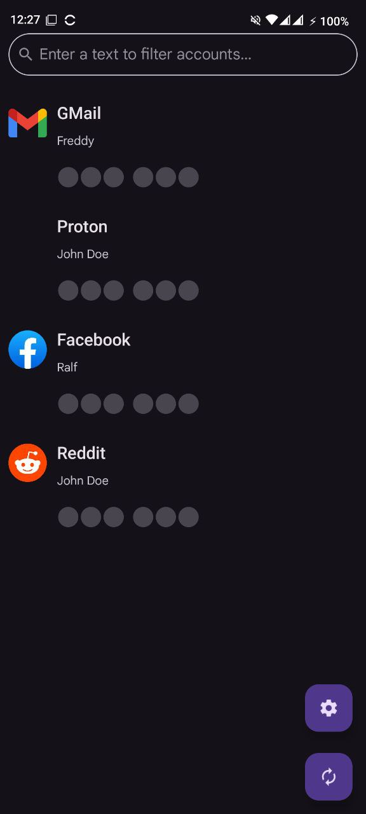
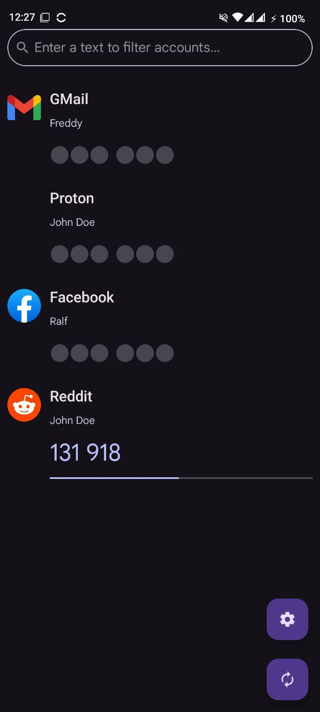

# PURPOSE

The purpose of this app is to facilitate access to 2FA tokens managed through <A HREF="https://github.com/Bubka/2FAuth">Bubka's 2FAuth service</A>.

To do this, we have developed an Android App that reads 2FA accounts from a user server and stores them locally, allowing the generation of 2FA codes even when we are not connected to the server.

# MAIN FEATURES

- Free and open source
- Secure
- The vault is encrypted (AES-256-GCM), and can be unlocked with:
  * Password
  * Biometrics (Android Keystore)
- We store server URL, token and app unlock PIN code encrypted with a secure key stored at Android Keystore
- Screen capture prevention
- Tap to reveal (capable to show current and next TOTP code)
- Compatible with Google Authenticator
- Supports industry standard algorithms: HOTP and TOTP
- Alphabetic/last use sorting
- Search by name/issuer

# SCREENSHOTS

 

# CERTIFICATE SIGNATURE VERIFICATION

The SHA-256 digest of the certificate used to sign the app is as follows, and remains constant regardless of the version:

`730d15ddea95e04a3d8201a577dfb7c5490dbf0f489f33de8061651067cd2582`

The app signature certification can be checked by the following command:

`apksigner verify --verbose --print-certs app-release.apk | grep "Signer #1 certificate SHA-256 digest"`

# OPEN SOURCE LIBRARIES WE USE

We generate the TOTP/HOTP codes using the JAVA library from <A HREF="https://github.com/BastiaanJansen/otp-java">Bastiaan Jansen</A> (<A HREF="https://github.com/BastiaanJansen/otp-java/blob/main/LICENSE">license summary</A>).
To generate STEAM OTP codes we have translated to Java the Python Algorithm from <A HREF="https://github.com/Art-em1s/Steam-OTP">Art-em1s</A> (<A HREF="https://github.com/Art-em1s/Steam-OTP/blob/master/LICENSE.md">license summary</A>).

We use <A HREF="https://github.com/sqlcipher/sqlcipher-android">SQLCipher</A> to encrypt the Accounts database (<A HREF="https://github.com/sqlcipher/sqlcipher/blob/master/LICENSE.md">license summary</A>).

Because Bubka 2FA uses SVG icons by default and Android does not natively support that graphic format, we use <A HREF="https://github.com/homarr-labs/dashboard-icons">Dashboard Icons</A> to download icons that are in that format (to search for icons we use the 2FA account service name, in lowercase and with blank spaces replaced by dashes) (<A HREF="https://github.com/homarr-labs/dashboard-icons/blob/main/LICENSE">license summary</A>).

To design the app icon, we made modifications to the <A HREF="https://pictogrammers.com/library/mdi/icon/account-lock/">account-lock</A> icon available at <A HREF="https://pictogrammers.com">Pictogrammers.com</A> (<A HREF="https://pictogrammers.com/docs/general/license">license summary</A>).

# DONATE

If you want, you can invite me to a coffee or a seafood platter

# DISCLAIMER

THIS SOFTWARE IS PROVIDED "AS IS" AND ANY EXPRESS OR IMPLIED WARRANTIES, INCLUDING, BUT NOT LIMITED TO, THE IMPLIED WARRANTIES OF MERCHANTABILITY AND FITNESS FOR A PARTICULAR PURPOSE ARE DISCLAIMED.

IN NO EVENT SHALL WE BE LIABLE FOR ANYONE DIRECT, INDIRECT, INCIDENTAL, SPECIAL, EXEMPLARY, OR CONSEQUENTIAL DAMAGES (INCLUDING, BUT NOT LIMITED TO, PROCUREMENT OF SUBSTITUTE GOODS OR SERVICES; LOSS OF USE, DATA, OR PROFITS; OR BUSINESS INTERRUPTION) HOWEVER CAUSED AND ON ANY THEORY OF LIABILITY, WHETHER IN CONTRACT, STRICT LIABILITY, OR TORT (INCLUDING NEGLIGENCE OR OTHERWISE) ARISING IN ANY WAY OUT OF THE USE OF THIS SOFTWARE, EVEN IF NO ADVISED OF THE POSSIBILITY OF SUCH DAMAGE.

# LICENSE

This app is licensed under the terms of the <A HREF="https://creativecommons.org/licenses/by-nc-sa/4.0/deed.en">CC BY-NC-SA 4.0</A> License.

